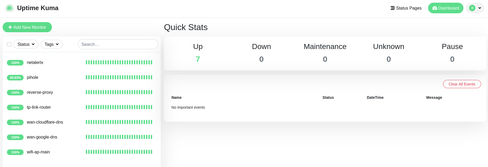
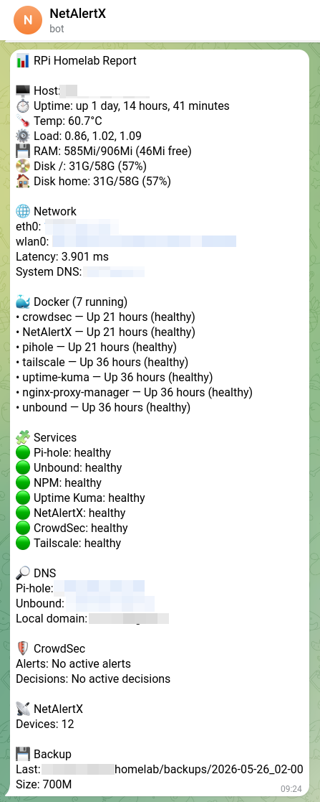
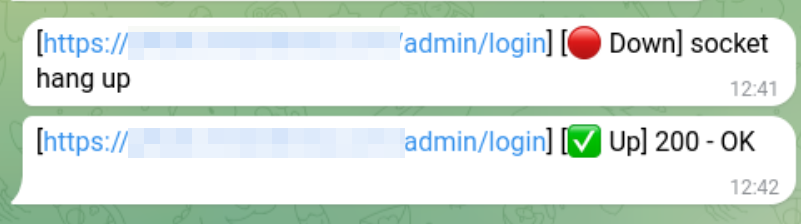
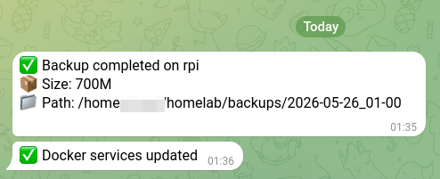
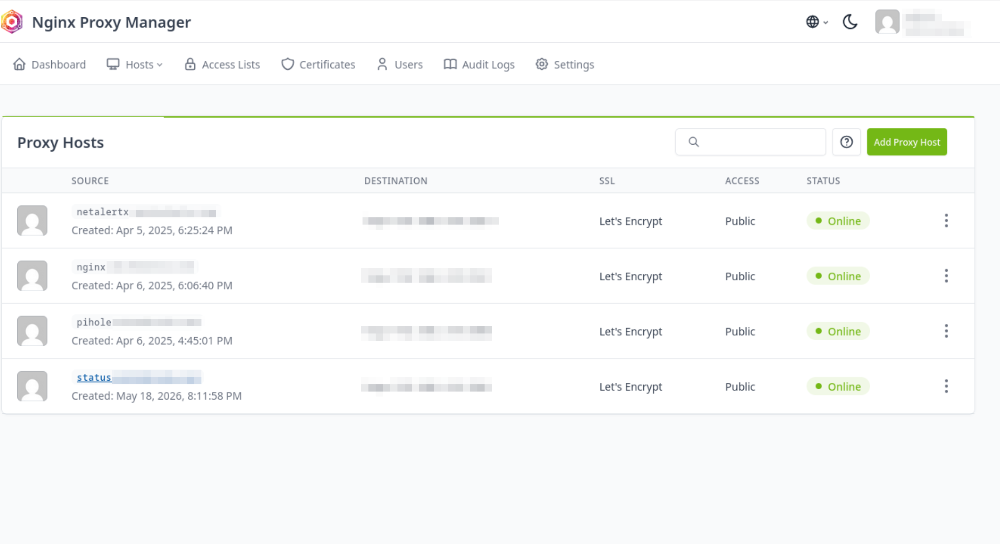
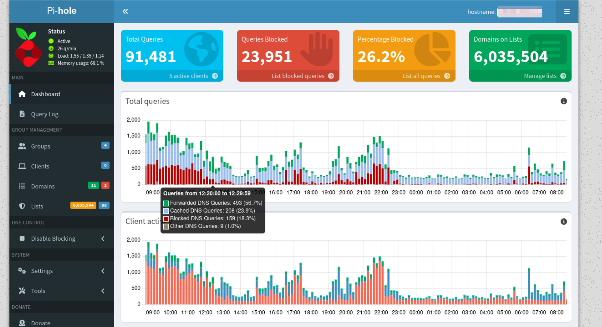
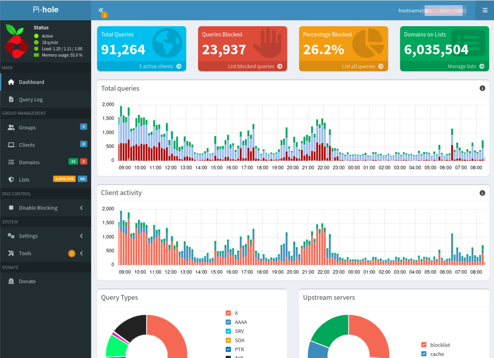

# Raspberry Pi Homelab


> Production-style Raspberry Pi homelab built on a Raspberry Pi 4. Monitors the local network, filters DNS, proxies HTTPS traffic, detects intrusions, and backs itself up automatically. Zero public ports — all remote access via Tailscale VPN.



---

## Overview

A fully self-hosted homelab stack running on a single Raspberry Pi 4, built to demonstrate production-style infrastructure engineering on constrained hardware. Covers the full DevOps/SRE lifecycle: OS provisioning, service orchestration, monitoring, alerting, security hardening, backup automation, and documented disaster recovery.

**Design goals:**

- **No public ports** — external access only via Tailscale VPN or HTTPS with wildcard Let's Encrypt certificates
- **Resilient by design** — automated daily backups, one-command restore, documented RTO of ~1 hour
- **Observable** — every service has health checks; any anomaly triggers a Telegram alert exactly once; recovery sends a follow-up
- **Safe to update** — `update.sh` runs `backup.sh` first; a failed backup aborts the entire update

---

## Highlights

- Automated Docker Compose stack — 7 services with health checks and independent per-service update flow
- Pi-hole + Unbound — recursive DNS with ad-blocking for the entire LAN, config versioned in Git
- Uptime Kuma — visual status dashboard with per-service health tracking
- Stateful Telegram alerting — fires once on incident (disk, temp, unhealthy container, kernel reboot), sends recovery confirmation when resolved
- CrowdSec — parses Nginx Proxy Manager logs for intrusion detection
- Nginx Proxy Manager — wildcard Let's Encrypt certs via Cloudflare DNS-01, LAN HTTPS for all services
- Tailscale VPN — zero-config secure remote access, no port forwarding required
- Automated backup & restore — daily compressed snapshots of all service data, one-command restore script
- Pre-update backup gate — `update.sh` refuses to proceed if the backup fails
- Disaster recovery playbook — full RTO documented, full recovery in ~1 hour

---

## Stack

| Service | Role | Port |
|---------|------|------|
| [Pi-hole](https://pi-hole.net) | DNS ad-blocking | :53 / :8080 |
| [Unbound](https://nlnetlabs.nl/projects/unbound/) | Recursive DNS resolver | :5335 |
| [Nginx Proxy Manager](https://nginxproxymanager.com) | Reverse proxy + SSL | :80 / :443 |
| [Uptime Kuma](https://github.com/louislam/uptime-kuma) | Service monitoring dashboard | :3001 |
| [NetAlertX](https://github.com/jokob-sk/NetAlertX) | Network device scanner | :20211 |
| [CrowdSec](https://crowdsec.net) | Intrusion detection | internal |
| [Tailscale](https://tailscale.com) | VPN remote access | host |

**Hardware:** Raspberry Pi 4 Model B · 4 GB RAM · USB SSD · Ethernet

---

## Architecture

```mermaid
flowchart TD
    Client[LAN / Wi-Fi Clients]
    Router[Router / DHCP]
    RPi[Raspberry Pi&#10;192.168.0.101]

    Client --> Router
    Router --> RPi

    subgraph RPi_Homelab[Raspberry Pi Homelab]
        PiHole[Pi-hole&#10;DNS :53 · Admin :8080]
        Unbound[Unbound&#10;DNS resolver :5335]
        NPM[Nginx Proxy Manager&#10;HTTP :80 · HTTPS :443]
        Kuma[Uptime Kuma&#10;:3001]
        NetAlertX[NetAlertX&#10;:20211]
        CrowdSec[CrowdSec&#10;NPM log analysis]
        Tailscale[Tailscale&#10;Remote VPN]
        Telegram[Telegram Alerts]
        Backup[Automated Backups]
    end

    Client -->|DNS| PiHole
    PiHole -->|Upstream DNS| Unbound
    Unbound --> Internet[Internet]

    Client -->|HTTPS *.domain| NPM
    NPM --> Kuma
    NPM --> NetAlertX
    NPM --> PiHole

    CrowdSec -->|reads logs| NPM
    Kuma -->|alerts| Telegram
    RPi -->|daily backup| Backup
    Tailscale --> RPi
```



---

## Monitoring & Alerting

Uptime Kuma tracks every service. `monitor.sh` runs on cron and sends a Telegram alert on disk pressure, high temperature, unhealthy container, or pending kernel reboot — exactly once per event, with a follow-up when the issue clears.

| Screenshot | |
|---|---|
|  |   |

### Daily Report Sample

```
📊 RPi Homelab Report

🖥 Host: rpi
⏱ Uptime: up 3 days, 14 hours
🌡 Temp: 47.2°C
⚙ Load: 0.18, 0.22, 0.20
💾 RAM: 1.2G/3.7G (2.1G free)
📀 Disk /: 8.1G/29G (28%)
🏠 Disk home: 8.1G/29G (28%)

🌐 Network
eth0: 192.168.x.x
Latency: 12.4 ms
System DNS: 127.x.x.x

🐳 Docker (7 running)
• pihole — Up 3 days (healthy)
• unbound — Up 3 days (healthy)
• nginx-proxy-manager — Up 3 days (healthy)
• uptime-kuma — Up 3 days (healthy)
• NetAlertX — Up 3 days (healthy)
• crowdsec — Up 3 days (healthy)
• tailscale — Up 3 days (healthy)

🧩 Services
🟢 Pi-hole: healthy
🟢 Unbound: healthy
🟢 NPM: healthy
🟢 Uptime Kuma: healthy
🟢 NetAlertX: healthy
🟢 CrowdSec: healthy
🟢 Tailscale: healthy

🔎 DNS
Pi-hole: x.x.x.x
Unbound: x.x.x.x

📡 NetAlertX
Devices: 24

💾 Backup
Last: /x/x/x/backups/2026-05-25
Size: 142M
```

---

## Reverse Proxy

Nginx Proxy Manager handles all LAN HTTPS traffic with wildcard Let's Encrypt certificates issued via Cloudflare DNS-01 challenge. Each service gets its own subdomain; no service is directly exposed.



---

## DNS Infrastructure

Pi-hole provides DNS ad-blocking for the entire LAN. Unbound acts as a local recursive resolver — queries go directly to root servers, bypassing upstream providers. Custom local DNS records are versioned in Git (`.example` template committed, real file gitignored).

| Screenshot | |
|---|---|
|  |  |

---

<br/>

---

# Technical Documentation

---

## Prerequisites

- Raspberry Pi 4 (2 GB RAM minimum, 4 GB recommended)
- Raspberry Pi OS Lite (64-bit) or Debian/Ubuntu Server
- Domain name with Cloudflare DNS (for Let's Encrypt wildcard certs)
- Telegram bot token and chat ID (for alerts)
- Tailscale account (free tier sufficient)

---

## Quick Start

### 1. Provision the OS

```bash
git clone git@github.com:YOUR_USER/homelab.git ~/homelab
cd ~/homelab
sudo ./provision.sh
```

`provision.sh` installs Docker, configures hostname, timezone, SSH, swap, and applies the Docker daemon config.

### 2. Replace the example domain

```bash
find docs/ -name "*.md" -exec sed -i 's/example\.com/yourdomain.com/g' {} +
```

### 3. Create `.env`

```bash
cp .env.example .env
nano .env
```

See [Configuration](#configuration) below for a reference of all variables.

### 4. Configure Pi-hole local DNS

```bash
cp config/pihole-custom-dns.list.example config/pihole-custom-dns.list
nano config/pihole-custom-dns.list
```

### 5. Start all services

```bash
make start
make status
```

### 6. Install cron jobs

```bash
make install
```

This schedules automated backups, monitoring, and daily reports.

---

## Configuration

All secrets live in a single `.env` file at the repo root. It is gitignored — never commit it.

| Variable | Description |
|---|---|
| `PIHOLE_PASSWORD` | Pi-hole v6+ web UI / API password |
| `TS_AUTHKEY` | Tailscale auth key (one-time or reusable) |
| `TELEGRAM_BOT_TOKEN` | Bot token from @BotFather |
| `TELEGRAM_CHAT_ID` | Chat ID for alert delivery |
| `CF_API_TOKEN` | Cloudflare scoped API token (Zone → DNS → Edit) |

Full annotated template: [`.env.example`](.env.example)

> **Note on CF_API_TOKEN:** Use a scoped token limited to a single zone, not the Global API Key. If it expires, create a new one in the Cloudflare dashboard and update it in the NPM web UI under the DNS challenge configuration.

---

## Scripts

All scripts live in [`scripts/`](scripts/). Most are also exposed as `make` targets.

| Script | `make` target | Description |
|--------|---------------|-------------|
| `update.sh` | `make update` | Backup → pull new images → restart; aborts if backup fails |
| `backup.sh` | `make backup` | Manual backup of all service data |
| `restore.sh` | — | Restore from a backup directory; validates `.env`, creates networks, starts services |
| `monitor.sh` | `make monitor` | Health/disk/temp check; fires Telegram alerts statefully |
| `rpi-report.sh` | `make report` | Send full Telegram system report now |
| `check-updates.sh` | `make check-updates` | Check Docker Hub for newer image versions |
| `install-cron.sh` | `make install` | Install cron jobs + logrotate |
| `setup-firewall.sh` | `make firewall` | Apply Docker-aware iptables rules via systemd service |
| `start-all.sh` | `make start` | Start all Docker Compose services |
| `stop-all.sh` | `make stop` | Stop all Docker Compose services |
| `os-update.sh` | `make os-update` | Refresh apt package list |

```bash
make help   # print all available targets with descriptions
make logs   # tail the update log
```

---

## Backup & Restore

### What gets backed up

```text
~/homelab/data/
├── pihole/          Pi-hole configuration
├── unbound/         Unbound configuration
├── nginx/           NPM configuration
├── nginx-letsencrypt/  Let's Encrypt certificates
├── uptime-kuma/     Uptime Kuma data
├── netalertx/       NetAlertX database
├── crowdsec/        CrowdSec data
└── tailscale/       Tailscale state
```

The Git repository itself covers everything else: compose files, scripts, docs, automation.

### Manual backup

```bash
make backup
```

Backups are written to `~/homelab/backups/YYYY-MM-DD_HH-MM/`.

### Restore

Copy a backup to the target host, then:

```bash
scp -r backups/2026-05-25_03-15 rpi:~/homelab/backups/
cd ~/homelab
./scripts/restore.sh
```

`restore.sh` validates `.env`, creates required Docker networks, restores application data, and starts all services.

---

## Disaster Recovery

Full procedure documented in [docs/disaster-recovery.md](docs/disaster-recovery.md).

### Quick reference

1. Install Raspberry Pi OS Lite / Debian / Ubuntu Server
2. `sudo apt update && sudo apt upgrade -y`
3. `git clone git@github.com:YOUR_USER/homelab.git ~/homelab && cd ~/homelab`
4. `sudo ./provision.sh`
5. Restore `.env` and `config/pihole-custom-dns.list`
6. Copy latest backup to `~/homelab/backups/`
7. `./scripts/restore.sh`
8. `./scripts/install-cron.sh`
9. Verify: `make status`

### Verification

```bash
# DNS
dig google.com @127.0.0.1
dig google.com @127.0.0.1 -p 5335

# HTTPS
curl -Ik https://status.yourdomain.com
```

### Recovery time estimates

| Scenario | Estimated time |
|---|---|
| Full OS reinstall + restore | ~1 hour |
| SD card migration | 10–20 min |
| Restore from backup only | 5–10 min |

---

## Maintenance

### Routine update

```bash
make update
```

Runs: backup → `docker compose pull` → restart → Telegram notification. Each service is updated independently; failures are collected and reported without stopping other services.

### Check for new image versions

```bash
make check-updates
```

### OS packages

```bash
make os-update
```

### View update log

```bash
make logs
```

### Firewall

```bash
make firewall
```

Installs a systemd service that rewrites `DOCKER-USER` iptables rules after every Docker restart. Public ports (80/443) open, admin ports (8080/8181) LAN-only.

See [docs/network.md](docs/network.md) for full firewall rule details.

---

## Project Structure

```text
.
├── compose/          Docker Compose files per service
├── config/           Versioned config (Docker daemon, Pi-hole DNS template)
├── data/             Runtime persistent data (NOT in git)
├── docs/             Architecture, networking, disaster recovery, troubleshooting
├── scripts/          Automation: update, backup, monitor, report, firewall
├── screenshots/      Dashboard and alert screenshots
├── backups/          Local backup archives (NOT in git)
├── .env.example      Secret template (commit this, never .env)
├── Makefile          All day-to-day commands
├── provision.sh      OS bootstrap script
└── versions.env      Pinned Docker image versions
```

Full architecture documentation: [docs/architecture.md](docs/architecture.md)

---

## Security Notes

- **Zero public ports** — 80 and 443 terminate at NPM with valid TLS; no admin ports are publicly exposed
- **Firewall** — `setup-firewall.sh` enforces LAN-only access to admin UIs (8080, 8181); Docker `DOCKER-USER` rules survive daemon restarts
- **CrowdSec** — parses NPM access logs; bans IPs at the iptables level
- **Tailscale** — all remote access goes through the Tailscale overlay network
- **Secrets** — single `.env` file, gitignored; each service receives only the variables it references
- **Cloudflare token** — scoped to Zone → DNS → Edit on a single zone; no global API key used

---

## What's Not in This Repo

| Item | Location |
|------|----------|
| Secrets / `.env` | Local only |
| Runtime data | `~/homelab/data/` |
| Let's Encrypt certificates | Managed by NPM, backed up in `data/` |
| Backup archives | `~/homelab/backups/` |
| Local DNS records | `config/pihole-custom-dns.list` (gitignored) |
