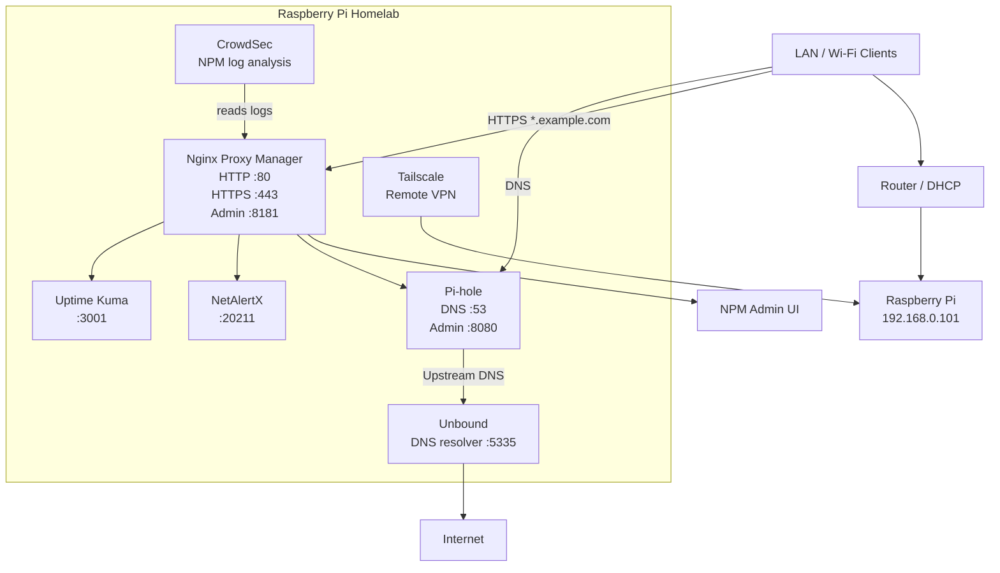

# Architecture Diagram



## DNS Flow

```text
Client
  -> Pi-hole 192.168.0.101:53
  -> Unbound 192.168.0.101:5335
  -> Internet
```

## HTTPS Flow

```text
Client
  -> https://service.example.com
  -> Nginx Proxy Manager
  -> internal service on Raspberry Pi
```

## Diagram
                         ┌──────────────────────┐
                         │      Internet         │
                         └──────────┬───────────┘
                                    │
                         ┌──────────▼───────────┐
                         │       Unbound         │
                         │     DNS :5335         │
                         └──────────▲───────────┘
                                    │
                         ┌──────────┴───────────┐
                         │       Pi-hole         │
                         │ DNS :53 / UI :8080    │
                         └──────────▲───────────┘
                                    │
┌──────────────────────┐            │
│   LAN / Wi-Fi Client │────────────┘
└──────────┬───────────┘
           │ HTTPS *.example.com
           ▼
┌────────────────────────────────────────────────────────────┐
│                 Raspberry Pi / Homelab                     │
│                    192.168.0.101                            │
│                                                            │
│  ┌──────────────────────────────────────────────────────┐  │
│  │              Nginx Proxy Manager                     │  │
│  │        :80 / :443 / admin :8181                      │  │
│  └───────┬──────────────┬──────────────┬───────────────┘  │
│          │              │              │                  │
│          ▼              ▼              ▼                  │
│  ┌─────────────┐ ┌─────────────┐ ┌─────────────┐          │
│  │ Uptime Kuma │ │  NetAlertX  │ │   Pi-hole   │          │
│  │    :3001    │ │    :20211   │ │    :8080    │          │
│  └─────────────┘ └─────────────┘ └─────────────┘          │
│                                                            │
│  ┌─────────────┐                 ┌─────────────┐          │
│  │  CrowdSec   │◄── NPM logs ────│  NPM logs   │          │
│  └─────────────┘                 └─────────────┘          │
│                                                            │
│  ┌─────────────┐                                          │
│  │  Tailscale  │  Remote VPN access                       │
│  └─────────────┘                                          │
└────────────────────────────────────────────────────────────┘
